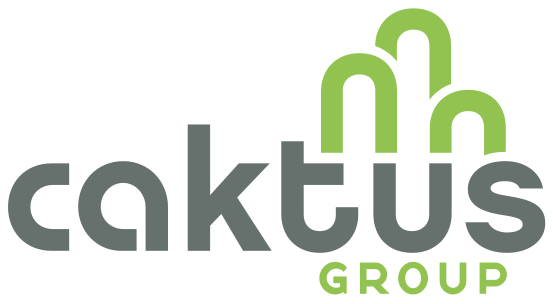
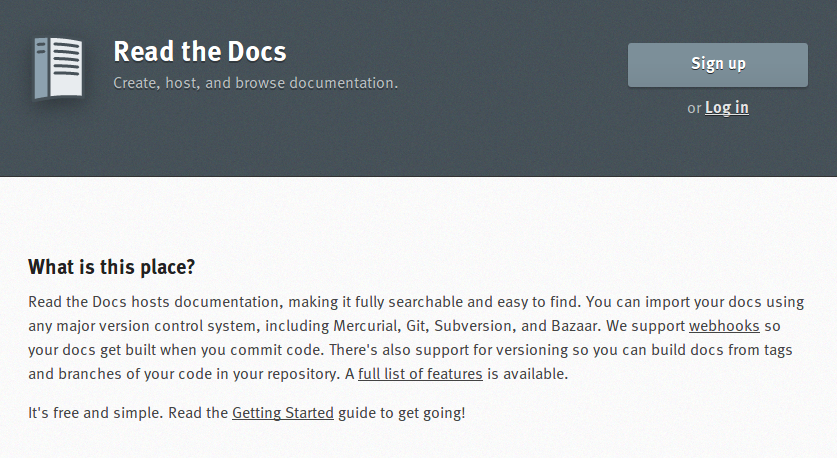
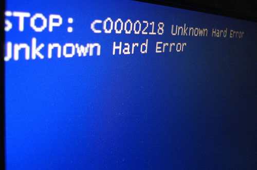

Maintaining Your Sanity
=================================================

While Maintaining Your Open Source App
-------------------------------------------------

Mark Lavin

----

What This Talk is About
-------------------------------------------------

Things that you won't find in the Django docs about writing an app

- Packaging an app
- Documenting an app
- Testing an app

----

Who Am I?
-------------------------------------------------

- Developer at Caktus Group in Carrboro, NC

- Founder/Developer for brewedbyus.com

Presenter Notes
---------------

- I think this is where I'm supposed to convince you I know what I'm talking about

----

Apps I've Open Sourced
-------------------------------------------------

- django-selectable
- django-email-bandit
- django-ad-code
- django-all-access
- django-scribbler
- django-responsive
- django-hilbert
- django-lastfm-auth
- django-meetup-auth

Presenter Notes
---------------

- Not everyone of these projects fits these perfectly
- These are ideas which have evolved from releasing more app
- Some of these things I wish I had done sooner

----

Non-Work Me
-------------------------------------------------

- Husband/Dad
- Runner/Triathlete
- Homebrewer

Presenter Notes
---------------

- These tools help you manage your time better

----

Packaging
-------------------------------------------------

http://www.flickr.com/photos/feesta/1411998505/

----

Packaging Insanity
-------------------------------------------------

    This app is so easy to install! You just checkout out the repo then add the app source directory to your Python path.

    -- No one ever

----

Packaging Sanity
-------------------------------------------------

- Package your app to work with pip (setuptools/distribute)
- Direct potential users to install with pip

Presenter Notes
---------------

- Keep the installation instructions simple and don't give choices
- `pip install django-something`

----

Setup.py
-------------------------------------------------

.. code-block:: python

    from setuptools import setup, find_packages

    setup(
        name='django-something',
        version=__import__('something').__version__,
        author='Mark Lavin',
        author_email='mlavin@caktusgroup.com',
        packages=find_packages(),
        include_package_data=True,
        url='https://github.com/mlavin/django-something',
        license='BSD',
        description=u'An app which does something',
        classifiers=[
            'Topic :: Internet :: WWW/HTTP :: Dynamic Content',
            'Intended Audience :: Developers',
            'License :: OSI Approved :: BSD License',
            'Programming Language :: Python',
            'Programming Language :: Python :: 2.6',
            'Programming Language :: Python :: 2.7',
            'Framework :: Django',
            'Topic :: Software Development :: Libraries :: Python Modules',
            'Development Status :: 4 - Beta',
            'Operating System :: OS Independent',
        ],
        long_description=open('README.rst').read(),
        zip_safe=False, # If you have static resources
    )

Presenter Notes
---------------

- It's pretty readable when you look at it
- Full list of classifiers is available on the PyPi site

----

Application Version
-------------------------------------------------

- Follow PEP386
- Try to be consistent in what your versions mean (new features/bug fixes)

.. code-block:: python

    # something.__init__.py
    "Short description of django-something."

    __version__ = '1.0.0'

----

MANIFEST.in
-------------------------------------------------

- Includes non-Python resources in your source distribution

.. code-block:: python

    include README.rst
    recursive-include something/static *
    recursive-include something/templates *

----

Register and Upload Your Package
-------------------------------------------------

.. code-block:: bash

    python setup.py register
    python setup.py sdist upload
    # Write more code
    # Write more docs
    # Update version
    python setup.py sdist upload

Presenter Notes
---------------

- Your package is now installable with pip!

----

Documentation
-------------------------------------------------

http://www.flickr.com/photos/plindberg/4294079/

----

Documentation Insanity
-------------------------------------------------

- A giant README
- Docs which aren't available online

Presenter Notes
---------------

- Python is very readable. Docs should describe what your source can't
- If users can find your docs they might as well not exist
- If users don't read them then you are wasting your time writing them

----

Documentation Sanity
-------------------------------------------------

- Sphinx & Read the Docs

Presenter Notes
---------------

- Keep your sanity by writing docs before you think you "need" them
- You will find yourself reading your own docs
- You will find better ways to do things when you have to explain how they work

----

Getting Started with Sphinx
-------------------------------------------------

``sphinx-quickstart`` has fairly sane defaults

.. code-block:: bash

    $ sphinx-quickstart
    ...
    Enter the root path for documentation.
    > Root path for the documentation [.]: docs
    ...

Repo will look something like this

.. code-block:: bash

    docs\
        conf.py
        index.rst
        make.bat
        MakeFile
    something\
        __init__.py
        models.py
        tests.py
        views.py
    README.rst
    setup.py

----

Things to Document
-------------------------------------------------

- A description of the project and its goals
- How to install including requirements
- How to configure
- Release notes

Presenter Notes
---------------

- Writing docs keeps you sane because you get a second pass at thinking about features
- Good documentation can answer questions from users before they ask you

----

Hosting Your Docs on Read the Docs
-------------------------------------------------

- Create an account
- Link to your repo
- Setup post-commit hook
- Pulls your tags/branches for different versions

Presenter Notes
---------------

- Django's docs are built here too

----

Testing
-------------------------------------------------

http://www.flickr.com/photos/snre/6946913449/

----

Testing Insanity
-------------------------------------------------

- Tests which fail without an example project
- Tests which fail when settings change

Presenter Notes
---------------

- Tests should ship with your app
- An example project should not
- Hard to shelter tests (even Django gets this wrong sometimes)

----

Testing Sanity
-------------------------------------------------

- Running tests needs to be easy
- Running tests needs to be fast

Presenter Notes
---------------

- Or else no one (including you) will run them

----

Test Only Models
-------------------------------------------------

`Ticket #7835 <https://code.djangoproject.com/ticket/7835>`_

    ...it appears to me that we already have a pretty good working solution for test-only models in trunk (and I'm wondering why I never thought of it). Apparently you can simply define models directly in your tests.py. Syncdb never imports tests.py, so those models won't get synced to the normal db, but they will get synced to the test database, and can be used in tests.

    -- Carl Meyer (Comment #24)

This approach is already used for Django's own test suite in ``contrib.contenttypes``

Presenter Notes
---------------

- This is used by django-selectable
- If this changes you'll know because you're going to have a test suite

----

Running App Tests (runtests.py)
-------------------------------------------------

.. code-block:: python

    #!/usr/bin/env python
    import sys
    from django.conf import settings

    if not settings.configured:
        settings.configure(
            DATABASES={
                'default': {
                    'ENGINE': 'django.db.backends.sqlite3',
                    'NAME': ':memory:',
                }
            },
            INSTALLED_APPS=(
                'something', # Don't forget dependencies
            ),
            SECRET_KEY='something-secret',
            SITE_ID=1,
            ROOT_URLCONF='something.tests.urls', # If needed
        )

    from django.test.utils import get_runner

    def runtests():
        TestRunner = get_runner(settings)
        test_runner = TestRunner(verbosity=1, interactive=True, failfast=False)
        sys.exit(test_runner.run_tests(['something', ]))

    if __name__ == '__main__':
        runtests()

Presenter Notes
---------------

- Loosely based on https://github.com/brosner/django-app-test-runner

----

Supercharge Your Tests with Tox
-------------------------------------------------

Install tox

.. code-block:: bash

    pip install tox

Tox uses virtualenv to run a test matrix

- Test different Python versions
- Test different Django versions
- Test different DB backends

----

Basic Tox Configuration
-------------------------------------------------

Configure tox.ini

.. code-block:: guess

    [tox]
    downloadcache = {toxworkdir}/_download/
    envlist = py26-1.4.X,py26-1.3.X

    [testenv]
    commands = {envpython} runtests.py

    [testenv:py26-1.4.X]
    basepython = python2.6
    deps = django>=1.4,<1.5

    [testenv:py26-1.3.X]
    basepython = python2.6
    deps = django>=1.3,<1.4

Presenter Notes
---------------

- Easy to jump to new Python/Django features and break compatibility

----

Running Tox
-------------------------------------------------

.. code-block:: bash

    # All environments
    $ tox
    ...
    [TOX] py26-1.4.X: commands succeeded
    [TOX] py26-1.3.X: commands succeeded
    # Only 1.4 on Python 2.6
    $ tox -e py26-1.4.X

Presenter Notes
---------------

- You can also use tox to build your documentation
- That way you'll know if they are broken prior to the Read the Docs build

----

Why Bother?
-------------------------------------------------

- These tools make it easy on you to write better code and docs
- And make it easier for others to help you
- Give contributors a starting point for more docs and tests

Presenter Notes
---------------

- Keep your sanity by having them in place before you think you'll need them

----

Non-Code Things To Do
-------------------------------------------------

http://www.flickr.com/photos/booleansplit/3944131005/

----

State Your Goals
-------------------------------------------------

- Let people know the problem you were trying to solve
- Let people know the problems you aren't interested in solving

Presenter Notes
---------------

- Not interested because it's not part of your main use case
- Not interested because solved by another project

----

Include a License
-------------------------------------------------

- There are plenty of good ones
- See OSI list if you aren't sure which to use http://opensource.org/licenses/index.html
- Let people know what they can (and can't) do with the code

----

Prepare for The Future
-------------------------------------------------

- Be ready for new Django releases
- Be ready for Python 3
- Be ready to be replaced (yourself or your code)

Presenter Notes
---------------

- Tox helps with the first two
- Who could take over this app if you stopped
- If you deleted this app which comparable one would you use

----

Non-Code Things To Avoid
-------------------------------------------------

http://www.flickr.com/photos/jmarty/3415590901/

----

Rejecting Every Contribution
-------------------------------------------------

- Don't make it impossible for people to help you
- If you have to reject a request be nice

Presenter Notes
---------------

- Keep your sanity by letting people help you

----

"This needs tests and docs"
-------------------------------------------------

Presenter Notes
---------------

- Not everyone is good a writing tests or docs
- Might need help or direction not heckling

----

Accepting Every Contribution
-------------------------------------------------

- Adding features is easy but taking them away is hard
- If you accept it you should be prepared to maintain it

Presenter Notes
---------------

- Keep your sanity by limiting your project scope

----

Developer Burnout
-------------------------------------------------

- It's ok to step away for awhile
- If you have these tools in place others can pick up in your place

Presenter Notes
---------------

- These things should make it easier
- Don't let open source feel like a burden

----

App Template
-------------------------------------------------

- Django 1.4 added app templates for ``startapp``
- I've created one using these ideas
- Use it/fork it for your next app
- https://github.com/mlavin/django-app-template

Presenter Notes
---------------

- I've made it easy for you so you have no excuse

----

Resources
-------------------------------------------------

- Packaging Guide: http://guide.python-distribute.org/
- PyPi Signup: http://pypi.python.org/pypi?%3Aaction=register_form
- PyPi Classifiers: http://pypi.python.org/pypi?%3Aaction=list_classifiers
- Sphinx: http://sphinx.pocoo.org/
- Read the Docs: http://readthedocs.org/
- Tox: http://tox.readthedocs.org/
- OSI License Info: http://opensource.org/licenses/index.html

----

Info
-------------------------------------------------

Slides

- HTML: http://mlavin.github.com/sanity-talk/
- Source: https://github.com/mlavin/sanity-talk

Me

- Github: https://github.com/mlavin/
- Bitbucket: https://bitbucket.com/mlavin/

